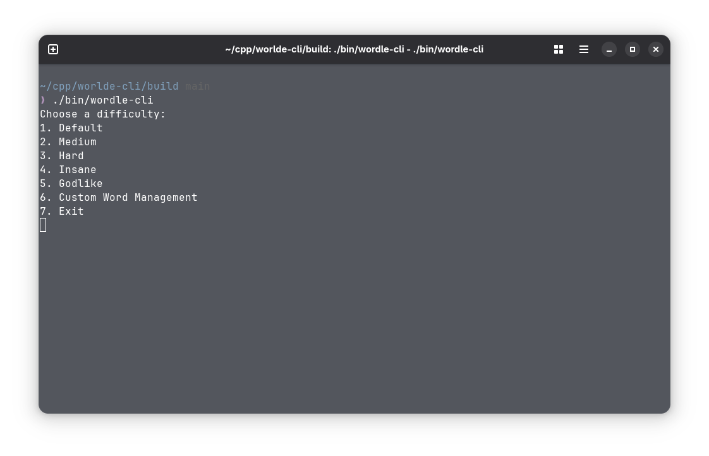
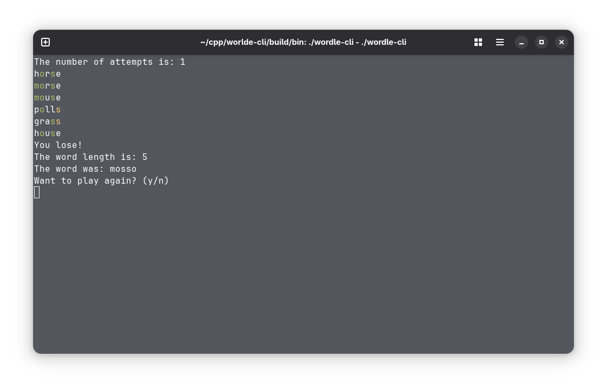

# wordle-cli
wordle-cli is my implementation of a famous game Wordle using C++ and SQLite. I made some additions to the game, such as different difficulties in terms of word lengths, and I made it possible to add your own words in the game permanently.

The word database has been pulled from this [repository](https://github.com/dwyl/english-words) and it has been super helpful, so please give them a star.

The database has been split in multiple smaller databases using my own scripts that you can find in `scripts` directory. I also made sure to remove short words and names that I took form [this](https://www.kaggle.com/datasets/rishitjakharia/names-txt/data) Kaggle dataset.

I decided to use SQLite to store words from the `english-words` repository. I used C++ bindings and wrappers from [this](https://github.com/SRombauts/SQLiteCpp) repository, so please leave a star there too as it has been prooved to be super helpful. I kept the library in the repository to ease building the binary.

#### Requirements:
1. A terminal emulator that supports colored output.

You can find prebuilt binaries of the game in the `Release` section. Make sure that the binary is in the same directory as the `res` folder which contains databases with words.

#### Building from source instructions
**Build instructions are outdated at the time of writing this line**
1. Prerequisets `git`,`CMake`,`C++ compiler`, `SQLiteCpp`.
2. Clone the repository `git clone https://github.com/kotique123/wordle-cli-cpp`
3. Go to repository directory `cd wordle-cli`
4. Make a build directory and go there `mkdir build && cd build`
5. Generate Makefiles `cmake -DCMAKE_BUILD_TYPE=Release ..`
6. Build `cmake --build .`
7. The files will be in `bin` directory. Launch the game with `./bin/wordle-cli`

